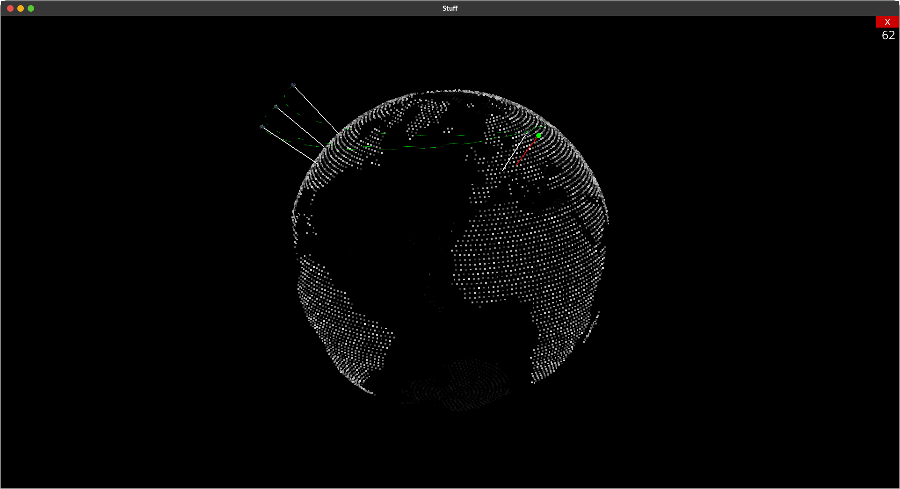

# IpLocationAnalyzer (Linux only)


Fetches all current connections, draws the servers and connection information. Adiddionally traceroutes for every connected server.

## Installation

This instruction assumes you have python3.10 installed. If you have not, please install it first!

Depending on your disto, install traceroute:

#### Debian

```bash
sudo apt update && sudo apt install traceroute
```

### Arch

```bash
sudo pacman -Sy traceroute
```

#### Fedora

```bash
yum -y install traceroute
```

If you use an older version of linux, you may need to adiddionally install `netstat`.
After installing traceroute, you now can clone the repository and install the python requirements:

```bash
git clone https://github.com/Nilusink/IpLocationAnalyzer.git && cd IpLocationAnalyer
python3.10 -m pip install -r requirements.txt
```

And thats it! Now run the program with:

```bash
python3.10 main.py
```

## Trace Explanation


|  *color* | *direction*    | *type*                    |
| ---------- | ---------------- | --------------------------- |
| green    | server to host | active connection         |
| white    | -              | stopped (wait) connection |
| red      | host to server | traceroute to server      |
| yellow   | host to server | last step of traceroute   |
